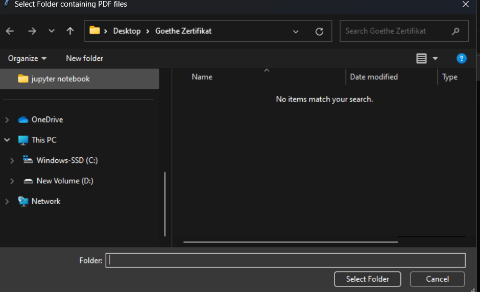
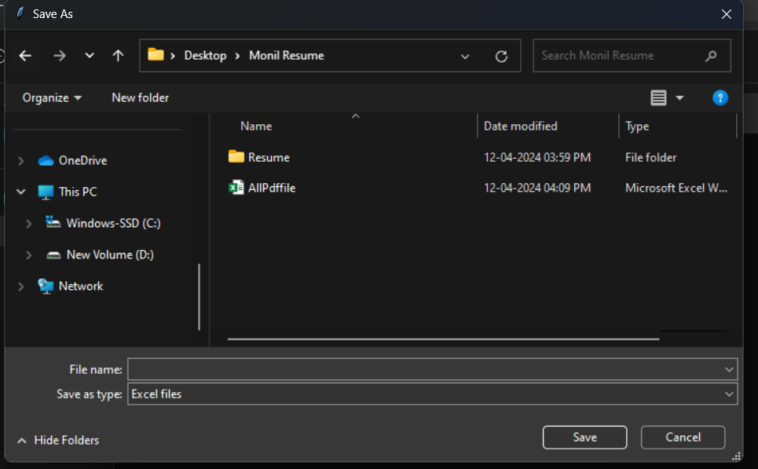

## Created a Simple utility to extract all the pdf file from given folder using Python

Steps:
- Clone the repo to local machine
- install the dependency from requirements.txt file using command `pip install -r requirements.txt`
- Open the Reading Pdf file Python.py and run it or try running executable file present in `dist` folder
  - It will open up a dialog box asking to select a folder from which all pdf need to be extracted as given below. So select the folder from where you need to get pdf.
    
    
  - Another window will open to save all the extracted file in excel format, so select the place where you wanto to excel file containing all pdf name
    

  - Open the Excel file, it contains all the pdf name in that specific folder

  Thank you

    
